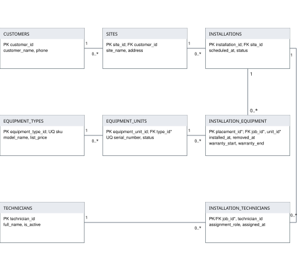
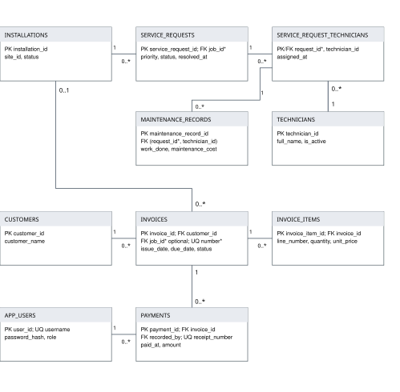

# SolarGrid Energy Service Management System
## Technical report

Cavendish University Zambia

IT212 Database Management Systems

Assignment 1 and CAT1

Lecturer: Mrs Memory Mumbi Lumbwe

Group 1

| Group member | Student number |
|---|---|
| Christopher Saputu | 127284 |
| Sailus Chileshe | 127-503 |
| Kamwi Abraham | 125078 |
| Nathan Kamalondo | 104-910 |
| Alpha Musausheni | 125869 |

Report date: 1 October 2026

Submission deadline: 12 October 2026

<!-- page break -->
# Executive summary

SolarGrid connects customer, site, equipment, installation, service and billing records in a MySQL database accessed through a Python Flask application. The solution addresses the difficulty of tracing installed equipment, technician assignments, warranty dates and customer balances across separate spreadsheets and paper files. Its scope follows the Group 1 scenario and compulsory requirements in the IT212 project brief (Lumbwe, 2026).

The implementation contains 15 related tables, two reporting views and two business stored procedures. Customer CRUD, application login, search, installation completion, service resolution, invoice creation and payment recording have been demonstrated against the database. In the September 30 demonstration, Sunrise Demo School (customer 14, site 18) had installation 18 completed with equipment unit 62. Service request 52 was resolved. Its ZMW 3,000 invoice received ZMW 1,000, leaving ZMW 2,000 outstanding.

The latest logical backup was restored into a separate database. Checks confirmed the schema objects and selected installation, equipment, maintenance and financial records. This provides evidence of recoverability for that snapshot; it is not a test of every possible failure or every restored record.

The system is a local classroom implementation. Equipment catalogue creation and additional technician assignment were subsequently confirmed during the live demonstration. Technician creation still requires a live form test. Concurrent sessions and crash recovery have not been demonstrated. The report distinguishes observed results from design reasoning and future improvements.

## Report guide

1. Requirements and business rules
2. Conceptual design and relational schema
3. Normalization
4. Implementation and sample data
5. SQL queries and reporting views
6. Stored procedures and transactions
7. Indexing and optimization
8. Security and application architecture
9. Testing and results
10. Backup and recovery
11. Evaluation and NoSQL extension
12. Deployment and demonstration
13. References
Appendix A. Screenshot evidence

<!-- page break -->
# 1 Requirements and business rules

SolarGrid serves households, schools, farms and businesses. Staff need to identify each customer and site, register serialized equipment, schedule work, assign technicians, record installation and maintenance work, issue invoices and accept payments. Management needs searchable histories, approaching warranty expiries, unresolved requests, workload and financial summaries (Lumbwe, 2026).

## Users and responsibilities

| User | Required access |
|---|---|
| Administrator | Customer CRUD, operational forms, billing and reports |
| Operations staff | Customer creation and editing, sites, equipment, jobs, service work and reports |
| Accounts staff | Invoice creation, payment recording and read access to reports |
| Database administrator | Schema setup, account grants, backup and restoration |
| Reporting database user | SELECT on the explicitly granted reporting objects and supporting tables |

Application roles and MySQL accounts are separate. A technician is a person assigned to work; a technician record does not automatically create a login.

## Rule enforcement

| Business rule | Enforcement |
|---|---|
| A site belongs to one customer; a job belongs to one site | Required foreign keys |
| Serial numbers, invoice numbers and receipt numbers are unique | UNIQUE constraints |
| A unit has at most one active placement | Generated active-unit column with a UNIQUE constraint |
| Dates, statuses and monetary values must be valid | CHECK constraints plus form validation |
| Maintenance must name an assigned technician | Composite foreign key to the service assignment |
| Installation completion requires available units and an active lead | Stored procedure checks inside a transaction |
| Payments must not exceed an issued invoice balance | Payment procedure validates and locks the invoice |
| An invoice linked to a job must belong to that job's customer | Invoice form validates the relationship |
| Only permitted staff can submit an action | Server-side application role checks |

## Scope decisions

One customer may have several sites and installations. Each invoice is for one customer and optionally one installation. Each payment applies to one invoice. All amounts are in ZMW. Scheduling does not reserve equipment. The implementation does not include tax calculations, refunds, credit notes, ownership transfers or a removal and redeployment interface. These are scope decisions, not additional assignment requirements.

<!-- page break -->
# 2 Conceptual design and relational schema

Entities are separated by business responsibility. A catalogue model describes many serialized units; a placement records a particular unit's installation and warranty period. Two association entities resolve the many-to-many relationships between technicians and installations, and technicians and service requests.

The following diagrams show identifiers, selected attributes and relationship cardinalities. All attributes and constraints are defined in 01_create_tables.sql. In the diagrams, 1 means exactly one, 0..1 means optional one and 0..* means zero or many. A child foreign key is required unless marked optional.



Figure 1. Customer, equipment and installation relationships.

Diagram abbreviations: job_id = installation_id; unit_id = equipment_unit_id; type_id = equipment_type_id; placement_id = installation_equipment_id. Asterisks indicate these abbreviated names.

An installation may initially have no placements or assignments. Completion imposes stronger workflow rules: equipment and an active lead must exist. A database foreign key alone cannot enforce these state-dependent minimums.

<!-- page break -->
## Service and billing relationships



Figure 2. Service and billing relationships. Repeated entities connect this diagram to Figure 1.

Abbreviations: request_id = service_request_id; job_id = installation_id; number = invoice_number. Other names match the relational mapping.

A maintenance record references the pair (service_request_id, technician_id), ensuring the technician is assigned to the request. Invoices retain their own customer link because they may be issued without an installation. When an installation is selected, its site owner must match the invoice customer.

Historical placements are retained using removed_at. A NULL removal date identifies an active placement; historical rows can coexist with a later placement of the same unit.

<!-- page break -->
## Relational mapping

PK denotes primary key; FK denotes foreign key; UQ denotes unique; ? denotes nullable. Names below match the implemented tables. ID columns are unsigned integers, with auto-increment for single-column primary keys.

| Relation | Keys and main attributes |
|---|---|
| customers | PK customer_id; customer_name, customer_type, phone, email?, billing_address?, is_active, created_at |
| sites | PK site_id; FK customer_id to customers; site_name, address, town, site_notes? |
| equipment_types | PK equipment_type_id; UQ sku; category, manufacturer, model_name, description?, default_warranty_months, list_price |
| equipment_units | PK equipment_unit_id; FK equipment_type_id; UQ serial_number; received_date, status |
| installations | PK installation_id; FK site_id; scheduled_at, completed_at?, status, work_description, completion_notes? |
| installation_equipment | PK installation_equipment_id; FK installation_id, equipment_unit_id; installed_at, removed_at?, warranty_start, warranty_end, placement_notes?; generated UQ active_equipment_unit_id |
| technicians | PK technician_id; full_name, phone, email?, specialization, is_active |
| installation_technicians | PK and FKs (installation_id, technician_id); assigned_at, assignment_role |
| service_requests | PK service_request_id; FK installation_id; reported_at, problem_description, priority, status, resolved_at? |
| service_request_technicians | PK and FKs (service_request_id, technician_id); assigned_at |
| maintenance_records | PK maintenance_record_id; composite FK (service_request_id, technician_id) to service_request_technicians; performed_at, work_done, maintenance_cost, next_service_date? |
| app_users | PK user_id; UQ username; password_hash, full_name, role, is_active |
| invoices | PK invoice_id; UQ invoice_number; FK customer_id, installation_id?; issue_date, due_date, status |
| invoice_items | PK invoice_item_id; FK invoice_id; UQ (invoice_id, line_number); item_type, description, quantity, unit_price |
| payments | PK payment_id; FK invoice_id, recorded_by to app_users; UQ receipt_number; paid_at, amount, payment_method, external_reference? |

All foreign keys use restrictive update and delete actions. For example, a customer with an existing site cannot be deleted. InnoDB checks foreign keys and requires supporting indexes (Oracle, n.d.-a).

<!-- page break -->
# 3 Normalization

The relational model separates logical data relationships from physical storage (Codd, 1970). The following worked examples demonstrate normalization of selected SolarGrid data. The short identifiers and names are illustrative examples rather than exported production records.

## Unnormalized form and first normal form

A paper installation record might contain Customer C01, Green Farm, phone 000-001, Site S01, North field, Job I01, and an equipment list {(U01, SN-A, PANEL), (U02, SN-B, BATTERY)}. It may also contain a separate list of technicians. Repeating lists make individual equipment items difficult to identify, validate and search.

For 1NF, represent each placement as a separate row with atomic values. Assign PlacementID as the key, and retain customer, job, site and equipment facts temporarily:

| PlacementID | Job | Site | Customer | Unit | Serial | Type |
|---|---|---|---|---|---|---|
| P01 | I01 | S01 | C01 | U01 | SN-A | T01 |
| P02 | I01 | S01 | C01 | U02 | SN-B | T02 |
| P03 | I02 | S02 | C01 | U03 | SN-C | T01 |

Each row also carries its installation and warranty dates. Technician lists become a separate assignment relation, avoiding a cross-product between equipment and technicians. Repeated customer and catalogue descriptions remain at this stage.

## Second normal form

The placement relation is already in 2NF under the stated single-column candidate key, PlacementID: there is no proper subset of that key. It still has transitive dependencies, so it is not yet in 3NF.

A separate assignment example demonstrates a genuine 2NF decomposition:

Assignment(InstallationID, TechnicianID, SiteID, TechnicianName, AssignedAt, AssignmentRole), with candidate key (InstallationID, TechnicianID).

- InstallationID determines SiteID: a partial dependency on the composite key.
- TechnicianID determines TechnicianName: another partial dependency.
- (InstallationID, TechnicianID) determines AssignedAt and AssignmentRole.

Decompose into Installations(InstallationID PK, SiteID), Technicians(TechnicianID PK, TechnicianName) and InstallationTechnicians(InstallationID PK/FK, TechnicianID PK/FK, AssignedAt, AssignmentRole). The junction now stores only facts about the whole assignment. Changing a technician name requires one update.

<!-- page break -->
## Third normal form

In the flat placement relation, the following transitive dependencies cause repetition:

- PlacementID determines InstallationID, which determines SiteID and ScheduledAt.
- SiteID determines CustomerID and SiteName.
- CustomerID determines CustomerName and Phone.
- EquipmentUnitID determines SerialNumber and EquipmentTypeID.
- EquipmentTypeID determines Category, Manufacturer and ModelName.

Decompose these facts into Customers, Sites, Installations, EquipmentTypes, EquipmentUnits and InstallationEquipment. The resulting placement relation contains PlacementID, InstallationID FK, EquipmentUnitID FK, InstalledAt, RemovedAt, WarrantyStart and WarrantyEnd. Customer names and model descriptions no longer repeat in it.

| Example determinant | Attributes dependent on it | Final relation |
|---|---|---|
| CustomerID | CustomerName, Phone | customers |
| SiteID | CustomerID, SiteName | sites |
| InstallationID | SiteID, ScheduledAt | installations |
| EquipmentTypeID | Category, Manufacturer, ModelName | equipment_types |
| EquipmentUnitID | EquipmentTypeID, SerialNumber | equipment_units |
| PlacementID | Job, unit and placement dates | installation_equipment |

Under these stated dependencies, each determinant in the decomposed relations is a candidate key, satisfying 3NF. Each split retains the extracted key as a foreign key. Joining the dependent relation to its keyed parent reconstructs the original facts without creating spurious combinations. The dependencies can be checked within their respective relations.

The design prevents update anomalies such as inconsistent customer telephone numbers, insertion anomalies such as needing a job before registering a unit, and deletion anomalies such as losing a catalogue model when its last placement is removed.

## Normalization and business semantics

Warranty dates describe a placement, not merely an equipment model. An invoice line's unit_price is the agreed historical price and need not equal the current catalogue price. Invoice totals and balances are derived, avoiding separately maintained totals.

The generated active_equipment_unit_id is a physical enforcement mechanism, not an independent business fact. The optional installation/customer association on invoices remains a consistency rule checked during issuance. These examples demonstrate normalization of selected data; they do not establish every possible functional dependency in the complete schema.

<!-- page break -->
# 4 Implementation and sample data

The application connects directly to MySQL on localhost port 3306. MySQL Workbench is used for SQL execution and inspection; Flask serves the browser interface on localhost port 5000. The demonstrated server reports version 26.7.0. The schema uses InnoDB, utf8mb4 and enforced CHECK constraints. Current shared-lock queries require MySQL 8.0.22 or later.

Money is stored as DECIMAL(12,2), quantities as DECIMAL(10,2), dates as DATE and event times as DATETIME. Phone numbers use VARCHAR to preserve leading zeros and the plus sign. Statuses use VARCHAR with case-sensitive domain checks. Examples include nonnegative maintenance costs, positive payments, positive quantities and a warranty end not preceding its start.

The active-unit rule is implemented using:

```sql
active_equipment_unit_id INT UNSIGNED GENERATED ALWAYS AS
  (CASE WHEN removed_at IS NULL
        THEN equipment_unit_id ELSE NULL END) STORED,
UNIQUE (active_equipment_unit_id)
```

Active placements yield a unique unit ID. Removed placements yield NULL, allowing historical rows. This constraint complements the completion procedure's availability checks.

## Meaningful sample records

The initial seed contains the following counts. These are baseline counts from the setup verification, not the later demonstration snapshot.

| Table | Initial rows | Table | Initial rows |
|---|---|---|---|
| customers | 12 | sites | 16 |
| equipment_types | 10 | equipment_units | 60 |
| installations | 16 | installation_equipment | 37 |
| technicians | 10 | installation_technicians | 32 |
| service_requests | 12 | service_request_technicians | 14 |
| maintenance_records | 12 | app_users | 3 |
| invoices | 16 | invoice_items | 64 |
| payments | 18 | | |

The seed provides varied customer categories, equipment states, job states, partial payments and warranty periods. Major business tables have at least ten records. The three initial application users represent role examples; the usable administrator was provisioned separately with a hashed password.

Later demonstrations added site 17, installation 17, unit 61, service request 13, maintenance and a new invoice and payment. Sample telephone numbers and example-domain email addresses are fictional classroom data.

<!-- page break -->
# 5 SQL queries and reporting views

DDL creates the schema, constraints, views and procedures. DML is demonstrated through INSERT for new customers, UPDATE for customer edits, DELETE for an unreferenced test customer and SELECT for reporting. Foreign keys reject deletion of referenced customers. The seed and SQL source files accompany the application.

## Filtering and sorting with an inner join

```sql
SELECT i.installation_id, c.customer_name, s.site_name,
       i.scheduled_at, i.status
FROM installations i
INNER JOIN sites s ON s.site_id = i.site_id
INNER JOIN customers c ON c.customer_id = s.customer_id
WHERE i.status = 'SCHEDULED'
ORDER BY i.scheduled_at;
```

This query identifies scheduled work with the correct customer and site. The application's history search uses bound parameters with LOCATE on customer and site names.

## Left join and grouped counts

```sql
SELECT sr.service_request_id, sr.priority, sr.status,
       COUNT(st.technician_id) AS assigned_technicians
FROM service_requests sr
LEFT JOIN service_request_technicians st
  ON st.service_request_id = sr.service_request_id
WHERE sr.status NOT IN ('RESOLVED', 'CANCELLED')
GROUP BY sr.service_request_id, sr.priority, sr.status
ORDER BY sr.service_request_id;
```

LEFT JOIN retains unassigned requests. COUNT of the technician column returns zero for these requests; COUNT(*) would count the retained request row instead.

## Meaningful nested query

```sql
SELECT i.installation_id
FROM installations i
WHERE i.status = 'COMPLETED'
AND NOT EXISTS (
  SELECT 1 FROM installation_equipment ie
  WHERE ie.installation_id = i.installation_id
);
```

This audit identifies completed installations without any placement history. It is an integrity diagnostic, not a repair operation. The supplied checking script includes a related audit for missing technician assignments.

<!-- page break -->
## Reporting views

v_invoice_balances combines invoices and customers with separately grouped line totals and payment totals. LEFT JOIN and COALESCE preserve invoices with no payments. Aggregating each child set before joining avoids multiplying line amounts by the number of payments.

Invoice total = SUM(ROUND(quantity × unit_price, 2)).

Outstanding balance = invoice total − SUM(payment amount).

The view distinguishes DRAFT, CANCELLED, PAID, UNPAID and PARTIALLY_PAID. The application includes only ISSUED invoices in its financial summary totals. After the demonstration, invoice SG-APP-9e2c374628ce466c shows ZMW 500 total, ZMW 200 paid and ZMW 300 outstanding.

v_active_equipment_warranties joins placements, installations, sites, customers, units and catalogue models. It selects rows where removed_at IS NULL. Here “active” means a current placement, not necessarily an unexpired warranty; the report applies the requested expiry-date range.

```sql
SELECT customer_name, site_name, serial_number, warranty_end
FROM v_active_equipment_warranties
WHERE warranty_end BETWEEN '2026-09-13' AND '2026-12-12'
ORDER BY warranty_end, serial_number;
```

Both views use SQL SECURITY INVOKER. A caller must hold permissions on the supporting objects as well as the view; the grant script supplies these read permissions.

## Workload and monthly receipts

The workload report independently aggregates open installation assignments and open service assignments by technician, then left joins both sets to technicians. This avoids multiplying one set of assignments by the other. Agnes Mulenga showed zero open jobs and zero open requests after completing installation 17 and resolving request 13.

```sql
SELECT DATE_FORMAT(paid_at, '%Y-%m') AS receipt_month,
       SUM(amount) AS cash_received_zmw
FROM payments
GROUP BY DATE_FORMAT(paid_at, '%Y-%m')
ORDER BY receipt_month;
```

September 2026 receipts were ZMW 1,200, matching the demonstrated ZMW 1,000 and ZMW 200 payments. This is cash received by payment month across payment methods, not an accrual-revenue calculation.

<!-- page break -->
# 6 Stored procedures and transactions

## Completing an installation

sp_complete_installation accepts an installation ID, a JSON array of equipment and warranty dates, a completion timestamp and notes. It starts a READ COMMITTED transaction, locks the installation and checks that it is open and has an active lead technician. It processes units in ID order, checks availability and active placements, inserts placement records, marks units INSTALLED and marks the job COMPLETED. Success commits the changes; exception and warning handlers roll back and resignal failures.

The rollback demonstration used installation 13 with available unit 38 followed by already-installed unit 41. The procedure rejected the selection. Subsequent checks showed installation 13 still SCHEDULED with no completion date, unit 38 still AVAILABLE, unit 41 still INSTALLED and zero placements for job 13. Figures in Appendix A record this failed-operation evidence.

The later successful application demonstration completed job 17 using unit 61. Its placement retained the warranty period 13 September 2026 to 13 September 2028.

## Recording a payment

sp_record_payment locks the selected invoice, checks that it is ISSUED, validates the active recording user's role, calculates existing payments and rejects an amount exceeding the balance. It inserts a uniquely numbered receipt and commits. Matching repeated receipt details return ALREADY_RECORDED; conflicting reuse is rejected.

The application supplies the signed-in user ID, rather than allowing staff to choose recorded_by. Its timestamp is generated for each submission, so receipt uniqueness prevents duplicates but browser retries are not guaranteed to be an identical idempotent request. After an uncertain response, staff inspect the invoice before retrying.

## ACID applied to the installation

| Property | Application to SolarGrid |
|---|---|
| Atomicity | Placements, unit statuses and job completion commit together or roll back |
| Consistency | Availability, warranty and status checks combine with foreign keys and unique active placements |
| Isolation | READ COMMITTED plus row locks protects the job and selected units; other writers must wait |
| Durability | Committed changes rely on InnoDB logging and storage durability; backup provides a separate recovery mechanism |

InnoDB provides transaction and recovery mechanisms, but durability also depends on server settings and reliable storage (Oracle, n.d.-b). The project demonstrates rollback and snapshot restoration, not power-loss durability or concurrent-session stress testing.

<!-- page break -->
## Application transactions and concurrency

Scheduling inserts a job and its lead assignment in one transaction. Service registration inserts a request and its assignment together. Maintenance inserts work and optionally resolves the request together. Invoice issuance inserts the header and all entered lines together.

Parent records that are checked but not modified use shared locks until commit. The maintenance request itself retains an exclusive lock because its state may change. During testing, scheduling initially requested exclusive locks on read-only parent tables and received a permission error. The implementation was corrected to shared locks; the subsequent schedule and assignment succeeded.

MySQL shared locks protect selected rows from modification until transaction completion. From MySQL 8.0.22, FOR SHARE requires SELECT permission; FOR UPDATE also requires an applicable write or lock privilege (Oracle, n.d.-c). This distinction allows validation without granting unnecessary parent-table update rights.

The completion procedure orders units before locking, reducing one source of deadlocks. Deadlocks remain possible, and concurrent payment protection assumes all payment writers follow the invoice-locking procedure. The application has no direct INSERT privilege on payments.

## Boundaries requiring further hardening

Workflow validation is distributed between constraints, application code and procedures. A privileged direct SQL writer can bypass some application checks. In particular, direct invoice creation could violate the customer/job association, and direct insertion of invoice lines could change a balance outside the intended issuance workflow.

The invoice view rounds each line, whereas the current payment procedure sums unrounded products into a two-decimal total. The invoice form therefore accepts only quantities and prices whose product has at most two decimal places. A future procedure revision should centralize one rounding rule for all writers.

The installation procedure's malformed-JSON and NULL edge cases require additional direct-call tests and hardening. Its broad NOT FOUND handler is also used for cursor exhaustion. Successful browser tests do not establish that every possible stored-procedure input is safely rejected.

<!-- page break -->
# 7 Indexing and optimization

Composite indexes are chosen for the leading filters and joins used by the application. Indexes reduce selected read work but consume storage and add work to inserts and updates, so adding an index to every column is not justified (Oracle, n.d.-e).

| Index | Purpose |
|---|---|
| installations(status, scheduled_at) | Filter by job state and retrieve scheduled order |
| installation_equipment(removed_at, warranty_end) | Select current placements within an expiry range |
| installation_technicians(technician_id, installation_id) | Look up a technician's installation assignments |
| service_requests(status, reported_at) | Filter and order the service queue |
| service_request_technicians(technician_id, service_request_id) | Look up a technician's service assignments |
| invoices(customer_id, status, due_date) | Customer-specific invoice state and due-date searches |
| payments(paid_at) | Date-range payment searches |

Primary, unique and foreign-key-supporting indexes also protect identifiers and support joins. A full monthly aggregation without a date filter may still scan payment data. LOCATE substring searches are not claimed to benefit from a normal name index.

## Demonstrated plan comparison

```sql
EXPLAIN
SELECT installation_id, site_id, scheduled_at, status
FROM installations
WHERE status = 'SCHEDULED'
ORDER BY scheduled_at;
```

The captured plan used ix_installations_schedule with estimated cost 0.7 and estimated rows 2. Repeating the query with IGNORE INDEX (ix_installations_schedule) showed a table scan with estimated rows 16, a filter and a sort, and displayed cost 1.85.

These are optimizer estimates from the dataset at the time of the test, before the later demonstration job. They are not measured response times or a proven percentage speed improvement. Workbench elapsed times include other overhead and are not a controlled benchmark. The comparison supports the index choice for this query shape; larger datasets and EXPLAIN ANALYZE would provide stronger performance evidence.

<!-- page break -->
# 8 Security and application architecture

The browser submits forms to Flask. Flask checks the signed-in session, CSRF token, role and field values, then uses MySQL Connector/Python with bound parameters. It renders database results through Jinja templates. SQL identifiers in the generic registration forms are selected from fixed code constants, not user-supplied table names.

| Layer | Implementation |
|---|---|
| Presentation | HTML templates and CSS; customer search, forms, history and reports |
| Application | app.py, management.py, workflows.py and operations.py |
| Database access | Connector/Python; explicit transaction contexts; stored procedure calls |
| Persistence | MySQL InnoDB tables, constraints, views and procedures |

Passwords for MySQL are entered privately at startup and are not hard-coded in the source. Application passwords are stored as hashes; administrator provisioning uses Werkzeug password hashing. A signed session identifies the user. POST requests require a session CSRF token, and roles are checked server-side. HttpOnly and SameSite=Lax cookie settings support browser-side protection; Flask documents these controls and the need for explicit CSRF protection (Pallets, n.d.).

## Database least privilege

root is used for administration, while solargrid_app connects the running application. The application account has SELECT on needed tables, customer CRUD, operational INSERT permissions, restricted service-state UPDATE and EXECUTE on the two business procedures. It has no direct payment INSERT or direct equipment-status UPDATE through the supplied grants.

solargrid_report has SELECT on the specifically granted report views and supporting tables. A direct UPDATE of customers using this account was denied with MySQL error 1142, while reading the invoice view succeeded. The account does not have every table needed by the newer workload report.

The views execute with invoker rights. Procedures created by the administrator use the default definer context. Consequently, procedure validation is a security boundary. All browser users share one application MySQL account; individual roles are enforced in Flask, not as separate MySQL sessions.

## Operational limits

This deployment uses the local Flask development server. Production deployment would require HTTPS, a production server, appropriate Secure cookie settings, durable secret management and a distributed login-rate limiter. The current login-attempt limiter is in process memory. The random session secret changes on restart, requiring another login. The database account can read password hashes, so protecting its credential and restricting its access remain important.

<!-- page break -->
# 9 Testing and results

Evidence combines supplied live screenshots, retained database setup-test results and application tests using a mocked database. Mocked tests check routing, validation and transaction dispatch; they cannot prove MySQL privileges or SQL execution.

| September 13 test | Observed result |
|---|---|
| Initial schema and seed | 15 tables created; baseline counts checked |
| Integrity cases in isolated setup tests | Duplicate serial/receipt, invalid dates, missing parents, negative payment and unassigned maintenance rejected |
| Customer CRUD | Test customer created, viewed, edited and removed; referenced deletion protected |
| Reporting account | SELECT succeeded; customer UPDATE denied |
| Installation rollback | Job 13 unchanged; available unit 38 unchanged; no placements added |
| Site and schedule | Site 17 saved; installation 17 and lead Agnes Mulenga saved |
| Equipment and completion | Unit 61 registered AVAILABLE, then installed for job 17 |
| Service and maintenance | Request 13 registered and RESOLVED; inspection cost 0.00 |
| Invoice and payment | Demo invoice 500.00; payment 200.00; balance 300.00 |
| Workload and receipts | Agnes had zero open assignments; September receipts 1,200.00 |
| Latest restore | Object counts and all selected business-record checks matched |

The first payment attempt selected a different invoice and was rejected for overpayment. The intended ZMW 500 invoice still showed zero paid. Selecting the correct invoice then produced the expected ZMW 200 payment. This illustrates validation and the need to confirm the selected record.

The app test scripts cover authentication, CSRF, role denials, form validation, procedure dispatch and simulated invoice/scheduling rollback. Live tests subsequently exposed the locking-permission issue described in Section 6, which the mocks could not detect.

<!-- page break -->
## September 30 demonstration update

The operator confirmed the following results in the guided recording session. Except for the backup-completion screenshot and the pasted MySQL errors and execution plans, these are operator-reported results; the video files have not been independently reviewed for this report. Earlier screenshots in Appendix A remain evidence of the September 13 run.

| Test | Result confirmed by the operator |
|---|---|
| School workflow | Customer 14; site 18; catalogue type 11; equipment unit 62; installation 18 |
| Technician assignments | Agnes Mulenga as lead; Brian Musonda as assistant |
| Completion and service | Installation 18 COMPLETED; unit 62 INSTALLED; request 52 RESOLVED; maintenance cost 0.00 |
| Billing | Invoice 3,000.00; paid 1,000.00; outstanding 2,000.00; PARTIALLY_PAID |
| Overpayment rejection | Attempted 2,500.00 payment rejected; balances unchanged |
| Monthly receipts | September 2026 total 2,200.00, including the new 1,000.00 payment |
| Least privilege | Report SELECT succeeded; UPDATE denied with MySQL error 1142 |
| Index comparison | Index lookup cost 0.7, rows 2; ignored index scan/filter/sort cost 1.95, rows 17 |
| Rollback in restored database | Error 1644; job 13 SCHEDULED with NULL completion; unit 38 AVAILABLE; unit 41 INSTALLED; placements 0 |

Optimizer costs and row counts are estimates, not measured execution times. The rollback test verifies atomicity of this failed operation; it does not establish all concurrency or crash-recovery behaviour.

## Remaining verification

Equipment catalogue creation (type 11) and additional technician assignment (Brian Musonda on installation 18) were confirmed by the operator during the September demonstration. Technician creation has not yet received live demonstration evidence. Tests for simultaneous payments, competing equipment allocation, malformed direct procedure calls, production security and crash recovery remain outstanding. The final presentation must not represent these as completed tests.

<!-- page break -->
# 10 Backup and recovery

BACKUP.bat uses mysqldump with --single-transaction, --quick, --routines, --triggers and --events. It writes a .partial file and renames it to .sql only after successful completion. For InnoDB, a single-transaction dump provides a consistent transactional snapshot; schema changes must be avoided while it runs (Oracle, n.d.-d).

The latest tested file is solargrid_backup_27282_25735.sql, created on 30 September 2026. Its SHA-256 digest is:

```text
6c09ee32c617cb930598925644e50dcee4ec620ff64d04a019e2ccacbea238b3
```

The file was inspected for database-switching statements and qualified live-schema references before restoration. RESTORE-DEMO-20260930.bat invokes a helper fixed to this file and solargrid_restore_demo_20260930. The helper verifies the digest, checks that the target contains no tables, routines or events, and imports only after the empty-target check passes.

## Demonstrated restoration

1. Create solargrid_restore_demo_20260930 with utf8mb4 and the matching collation.
2. Run RESTORE-DEMO-20260930.bat and enter the administrator password privately for checking and import.
3. Confirm RESTORE COMPLETED for the test database.
4. Run VERIFY-DEMO-20260930.sql, beginning with USE solargrid_restore_demo_20260930 and SELECT DATABASE().
5. Compare restored objects and selected business records.

| Verification | Restored result |
|---|---|
| Selected database | solargrid_restore_demo_20260930 |
| Schema objects | Latest dump inspected: 15 base tables, 2 views, 2 procedures; earlier restore counts verified |
| Installation 18 | COMPLETED |
| Equipment unit 62 | DEMO-SCHOOL-PANEL-001, INSTALLED |
| Service request 52 | RESOLVED |
| Maintenance for request 52 | Inspection notes present; cost 0.00 |
| Demo invoice | Paid 1,000.00; outstanding 2,000.00 |

The earlier backup was tested independently in solargrid_restore_test. These checks do not establish byte-for-byte equality of every table or execute every restored procedure. The latest restored installation procedure was exercised separately in the failed rollback case.

## Potential data loss

This is a manual snapshot strategy. Changes committed after the snapshot could be lost; no binary-log point-in-time recovery or fixed backup schedule was demonstrated. Recovery time was not measured. Database accounts and grants are not included in a single-database dump and must be recreated separately. Restored views and routines also need valid definers and grants on a new server. Dumps contain application password hashes and should be stored with controlled access, with a separate protected copy off the laptop.

<!-- page break -->
# 11 Evaluation and NoSQL extension

The demonstrated solution meets the central scenario by connecting installations, equipment, technicians, maintenance and customer balances through one database-backed interface. The schema preserves history and reduces repeated facts. The completed multi-table workflow and independent restore test provide practical evidence beyond static screens.

The design also has limits. Customer CRUD is complete, while other registers currently emphasize creation and viewing. The application does not expose equipment removal, job rescheduling, refunds, credit notes or paid-invoice corrections. A demo job was completed before its planned date, which the current rules allow. If the business requires date-order enforcement, this must be specified and added explicitly.

Before assessment, the remaining forms should be tested and procedure edge cases reviewed. Financial rounding should be centralized. A larger dataset and simultaneous-session tests would improve confidence in concurrency and optimization claims. These activities extend the current evidence rather than changing the successful results already recorded.

## How NoSQL could complement MySQL

A document database could hold variable installation inspection checklists, device telemetry or service-note metadata, keyed by the MySQL installation or equipment ID. Different equipment models could report different measurements without repeatedly changing relational columns. MongoDB supports both embedded related data and references, so structure should follow access patterns (MongoDB, n.d.).

MySQL would remain authoritative for customer identities, assignments, invoices and payments. Documents could hold an installation_id, captured_at, checklist_version and an embedded set of inspection answers. Photos could remain in protected file storage with references in the document.

This extension would require access control, retention rules and a synchronization strategy. A MySQL foreign key cannot enforce a reference into a separate document store. Failures across the two stores would need retries or an outbox/event mechanism. NoSQL is proposed for the oral-defence discussion; it has not been implemented.

# 12 Deployment and demonstration

For a fresh installation, create the schema, load and commit the sample data, create views and procedures, create the two MySQL users privately, then apply 07_grant_permissions.sql and 08_operations_permissions.sql. START.bat creates the Python environment and installs requirements. Initial administrator provisioning needs sufficient setup privileges; normal operation uses solargrid_app.

Existing installations should not rerun database creation or seed scripts. The browser login solaradmin is distinct from the MySQL username solargrid_app. No passwords belong in the report or repository.

<!-- page break -->
## Source files and submission

| Deliverable | File or folder |
|---|---|
| Schema | SolarGrid-MySQL/01_create_tables.sql |
| Working seed for Workbench | SolarGrid-MySQL/02_insert_sample_data_editor.sql |
| SQL checks and queries | SolarGrid-MySQL/03_check_data_and_reports.sql |
| Views and procedures | SolarGrid-MySQL-Stage2/04_create_views.sql and 05_create_procedures.sql |
| Procedure verification and grants | SolarGrid-MySQL-Stage2/06_verify_stage2.sql, 07_grant_permissions.sql and 08_operations_permissions.sql |
| Application source | SolarGrid-App including templates, static, requirements.txt and START.bat |
| Normalization detail | SolarGrid-Normalization.md |
| Backup and restore tools | SolarGrid-Backup including the latest tested dump and VERIFY-DEMO-20260930.sql |
| Technical report | SolarGrid-Technical-Report.pdf |

The repository submission should include current source files rather than superseded ZIP bundles. Omit virtual environments, cache folders, passwords and incomplete .partial backups. The required database export contains password hashes; arrange controlled submission access and do not publish real credentials. The final source package and updated presentation accompany this report. GitHub publication and the recording links remain submission tasks for the group.

## Suggested live demonstration

Start with the ERD and explain the customer-site-installation chain and one many-to-many relationship. Demonstrate authorized customer CRUD using a clearly named temporary record. Search installation history, show a warranty report, then demonstrate a validated transaction and its failed case. Explain the index comparison, use the reporting account to show denied writes and show the restore evidence.

Every member should be able to explain keys, normalization, joins, a procedure, ACID, index order and the difference between application and database users. The brief permits the lecturer to select any member for a task or modification (Lumbwe, 2026). No individual contribution percentages are assigned in this report.

## Conclusion

SolarGrid demonstrates a relational design and a working application for the selected energy-service scenario. The observed workflow preserves the relationships from customer site through installed equipment, resolved service work and a partially paid invoice. The latest backup restores those selected facts successfully. The prepared submission package supports assessment; the remaining live tests, repository publication and individual oral preparation should be completed before submission.

<!-- page break -->
# 13 References

Codd, E.F. (1970) 'A relational model of data for large shared data banks', Communications of the ACM, 13(6), pp. 377-387. Available at: https://doi.org/10.1145/362384.362685 (Accessed: 14 September 2026).

Lumbwe, M.M. (2026) IT212 Project July 2026: Assignment 1 and CAT1. Cavendish University Zambia. Unpublished course assignment brief.

MongoDB (n.d.) Embedded data in your MongoDB schema. Available at: https://www.mongodb.com/docs/manual/data-modeling/embedding/ (Accessed: 14 September 2026).

Oracle (n.d.-a) FOREIGN KEY constraints. MySQL 26.7 Reference Manual. Available at: https://dev.mysql.com/doc/refman/26.7/en/constraint-foreign-key.html (Accessed: 14 September 2026).

Oracle (n.d.-b) InnoDB and the ACID model. MySQL 8.4 Reference Manual. Available at: https://dev.mysql.com/doc/refman/8.4/en/mysql-acid.html (Accessed: 14 September 2026).

Oracle (n.d.-c) Locking reads. MySQL 8.4 Reference Manual. Available at: https://dev.mysql.com/doc/refman/8.4/en/innodb-locking-reads.html (Accessed: 14 September 2026).

Oracle (n.d.-d) mysqldump A database backup program. MySQL 8.4 Reference Manual. Available at: https://dev.mysql.com/doc/refman/8.4/en/mysqldump.html (Accessed: 14 September 2026).

Oracle (n.d.-e) Optimization and indexes. MySQL 8.4 Reference Manual. Available at: https://dev.mysql.com/doc/refman/8.4/en/optimization-indexes.html (Accessed: 14 September 2026).

Pallets (n.d.) Security considerations. Flask documentation. Available at: https://flask.palletsprojects.com/en/stable/web-security/ (Accessed: 14 September 2026).

## Project evidence

SolarGrid Group 1 (2026) SolarGrid implementation scripts, application source, automated test results and screenshots, 12 September-1 October 2026. Unpublished project materials, including operator-confirmed demonstration results.

The technical observations and demonstration results in this report are drawn from these project materials. Screenshot captions give the capture date and time. The sample data are used for classroom demonstration.

<!-- page break -->
# Appendix A Screenshot evidence

## A1 Transaction rejection and unchanged data


Figure A1. Installation completion rejected because a selected unit was unavailable. Capture 13 September 2026 at 14:12:49.


Figure A2. The subsequent check found zero placements for installation 13. Capture 13 September 2026 at 14:14:47. Companion checks showed SCHEDULED status and unchanged equipment states.

<!-- page break -->
## A2 Permissions and index evidence


Figure A3. Reporting account denied UPDATE on customers. Capture 13 September 2026 at 18:12:41.


Figure A4. Indexed plan selects ix_installations_schedule. Capture 13 September 2026 at 20:10:14.


Figure A5. IGNORE INDEX comparison uses scan, filter and sort. Capture 13 September 2026 at 20:13:13.

<!-- page break -->
## A3 Completed service and financial workflow


Figure A6. Request 13 is RESOLVED and maintenance by Agnes Mulenga is retained at cost 0.00. Capture 13 September 2026 at 21:55:35.


Figure A7. Demo invoice shows 500.00 total, 200.00 paid and 300.00 outstanding. Capture 13 September 2026 at 22:18:46.

<!-- page break -->
## A4 Recovery evidence


Figure A8. Import completed into solargrid_restore_latest. Capture 13 September 2026 at 22:38:22.


Figure A9. SELECT DATABASE confirms the verification target. Capture 13 September 2026 at 22:42:54.


Figure A10. Restored invoice retains 200.00 paid and 300.00 outstanding. Capture 13 September 2026 at 22:44:16. The accompanying result tabs confirmed 15 tables, two views, two routines, completed job 17, installed unit 61 and resolved request 13.
